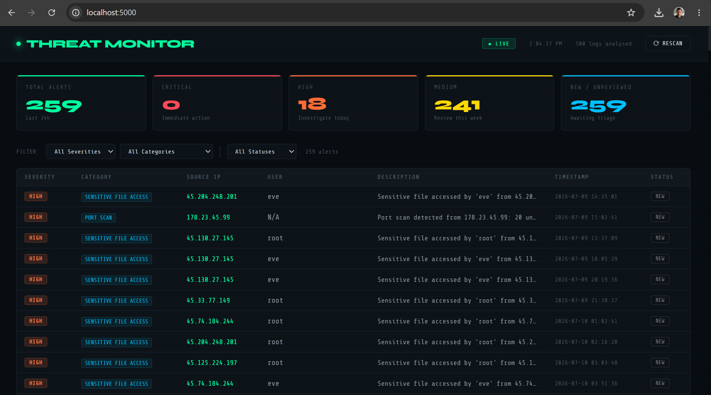

# 🛡️ SIEM Log Monitoring Dashboard

A Python-based SIEM tool that ingests security logs, detects attack patterns, and provides an interactive browser-based investigation dashboard.

## Quick Start

git clone https://github.com/kennysp19/siem-monitor.git
cd siem-monitor
pip install -r requirements.txt
python app.py

Then open your browser to http://localhost:5000

## What It Detects

| Detection | MITRE ATT&CK | Logic |
|---|---|---|
| Brute Force | T1110 | 5+ failed logins within 10 minutes from single IP |
| Port Scan | T1046 | 15+ unique ports probed from single source |
| Off-Hours Access | T1078 | Successful logins outside 8AM-6PM |
| Sensitive File Access | T1005 | Reads on /etc/shadow, SSH keys, SAM hive |

## How It Works

Security logs feed into a rule-based detection engine that maps findings to MITRE ATT&CK techniques. A Flask API serves the results to a browser dashboard where analysts can triage alerts, document findings, and track investigation status.

## Investigation Workflow

- Click any alert to open the detail panel
- Review evidence samples and MITRE technique
- Set status: New / Confirmed / Escalated / False Positive / Resolved
- Add analyst notes and save

## Planned Improvements

- Real CSV and syslog file ingestion
- Persistent SQLite storage for investigation state
- Email alerting on CRITICAL severity alerts
- See also: [Vulnerability Tracker](https://github.com/kennysp19/vuln-tracker)
